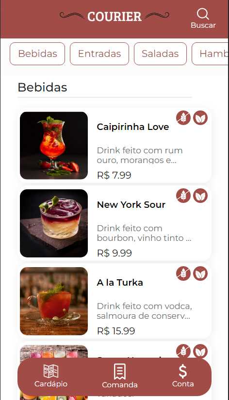
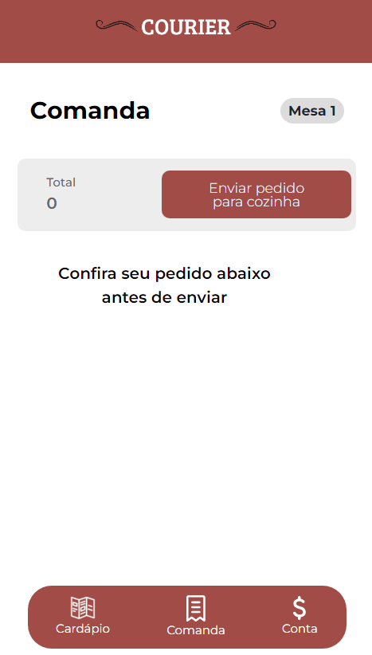
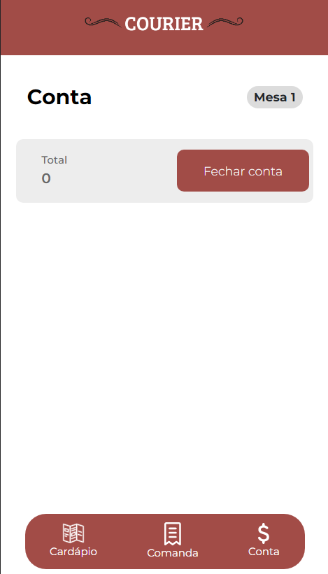

# COURIER

Nosso app é um cardápio virtual que tem funções como fazer pedidos, ver informações e adicionar à comanda. Ele tem como público alvo clientes de restaurantes e outros estabelecimentos com o objetivo de agilizar os pedidos e facilitar o trabalho dos garçons, oferecendo mais rapidez e agilidade, tornado o processo de fazer pedidos mais simples e prático.

<br>


<br>

## Competências Desenvolvidas

- React
- Redux
- TypeScript
- Bootstrap
- Styled-components
- Consumo de API com Axios

<br>

## Entregáveis

### • Para o cliente

1. Cardápio de produtos
2. Detalhes dos produtos
3. Execução do pedido pelo sistema
4. Fechamento de conta

### • Para o proprietário

1. Visualização dos pedidos que são feitos com exclusão quando são finalizados
2. Histórico de pedidos realizados e já finalizados

<br>

## Instalação

```text
git clone https://github.com/muryllohenriq/final-gama-g04-front.git
cd final-gama-g04-front
npm install
npm run dev
```

<br>

## Deploy

Confira [_aqui o deploy_](https://courier-tau.vercel.app/) do nosso projeto.

<br>

## Funcionalidades

1. Mobile First (Pensado especialmente para tablets e smartphones)
2. Produtos separados por categoria
3. Página de detalhes de cada prato

## Funcionalidades Futuras

1. Versão dark mode
2. Possibilidade de salvar o cardápio em PDF para disponibilizar cardápio físico caso um cliente não tenha conhecimento ou não consiga entrar na plataforma
3. Possibilidade de mudança de mesa

<br>

## Screenshots



<br>



<br>



<br>

## Tecnologias utilizadas


<br>

## Autores

<a href="https://github.com/jvdalaglio"></a>
<a href="https://github.com/Karolinegaia"></a>
<a href="https://github.com/muryllohenriq"></a>
<a href="https://github.com/alyce-developer"></a>
<a href="https://github.com/lusouzarego"></a>
<a href="https://github.com/MairlaSousa"></a>
<a href="https://github.com/keuwey"></a>
